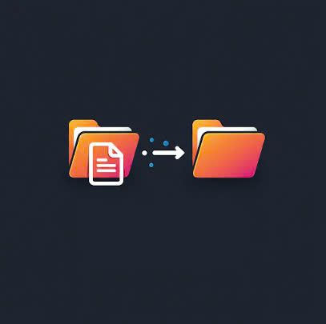

# EVNGENCO2 File Monitor - FDT Desktop

EVNGENCO2 File Monitor (FDT Desktop) là ứng dụng desktop được phát triển dành riêng cho việc giám sát và tự động hóa quản lý tệp, giúp người dùng tiết kiệm thời gian và tăng hiệu quả làm việc. Dự án này được xây dựng sử dụng công nghệ [Angular CLI](https://github.com/angular/angular-cli) phiên bản 19.2.3 kết hợp với [Electron Forge](https://www.electronforge.io/) để tạo ra ứng dụng đa nền tảng.

## Giới thiệu

EVNGENCO2 File Monitor là giải pháp hiệu quả giúp tự động hóa việc sắp xếp và phân loại tệp dựa trên các quy tắc do người dùng thiết lập. Hỗ trợ sao chép hoặc di chuyển tệp từ thư mục nguồn đến thư mục đích, ứng dụng giúp duy trì trật tự trong hệ thống tệp và tăng cường quản lý dữ liệu.



## Tính năng chính

### 1. Giám sát tệp thời gian thực

EVNGENCO2 File Monitor cho phép người dùng thiết lập giám sát thời gian thực các thư mục nguồn. Khi có tệp mới được tạo hoặc sửa đổi trong các thư mục này, ứng dụng sẽ ngay lập tức xử lý chúng theo các quy tắc đã được thiết lập.

- **Giám sát liên tục**: Theo dõi các thư mục một cách liên tục ngay cả khi ứng dụng được thu nhỏ vào khay hệ thống
- **Thông báo tức thì**: Hiển thị thông báo khi các tệp được xử lý thành công
- **Quét thủ công**: Cho phép quét và xử lý ngay lập tức tất cả các tệp hiện có trong thư mục nguồn

### 2. Quản lý quy tắc linh hoạt

Người dùng có thể tạo các quy tắc phức tạp để xác định cách xử lý tệp dựa trên tên và thuộc tính của chúng:

- **Biểu thức chính quy (Regex)**: Hỗ trợ đầy đủ biểu thức chính quy để khớp với các mẫu tên tệp phức tạp
- **Tạo thư mục con tự động**: Khả năng tạo thư mục con trong thư mục đích dựa trên thông tin trích xuất từ tên tệp
- **Lựa chọn thao tác**: Hỗ trợ cả hai thao tác sao chép (giữ nguyên tệp gốc) và di chuyển (xóa tệp gốc sau khi sao chép)
- **Quản lý trực quan**: Giao diện thân thiện cho phép thêm, xóa và quản lý các quy tắc dễ dàng

### 3. Nhật ký hoạt động chi tiết

Hệ thống ghi nhật ký toàn diện giúp người dùng theo dõi mọi hoạt động của ứng dụng:

- **Nhật ký thời gian thực**: Ghi lại tất cả các hoạt động bao gồm thời gian và kết quả
- **Thông tin lỗi**: Hiển thị chi tiết về các lỗi có thể xảy ra trong quá trình xử lý tệp
- **Giao diện nhật ký**: Xem và theo dõi nhật ký trực tiếp từ giao diện ứng dụng
- **Làm mới dữ liệu**: Cập nhật dữ liệu nhật ký theo yêu cầu

### 4. Tùy chỉnh và cài đặt

EVNGENCO2 File Monitor cung cấp các tùy chọn cài đặt linh hoạt để đáp ứng nhu cầu của người dùng:

- **Thu nhỏ vào khay hệ thống**: Cho phép ứng dụng chạy ẩn trong khay hệ thống thay vì đóng khi nhấn nút X
- **Tự động khởi động cùng Windows**: Tùy chọn khởi động ứng dụng tự động khi người dùng đăng nhập vào hệ thống
- **Menu khay hệ thống**: Truy cập nhanh vào các chức năng chính thông qua menu khay hệ thống
- **Giao diện hiện đại**: Thiết kế giao diện dựa trên Bootstrap 5 với các biểu tượng trực quan

### 5. Tính năng nâng cao

- **Hỗ trợ mẫu regex phức tạp**: Sử dụng nhóm bắt (capture groups) trong regex để trích xuất thông tin từ tên tệp
- **Phân tích thông minh**: Khả năng phân tích tên tệp để tạo cấu trúc thư mục phù hợp
- **Hiệu suất tối ưu**: Xử lý hàng loạt tệp trong thời gian ngắn mà không ảnh hưởng đến hiệu suất hệ thống
- **Tùy biến dễ dàng**: Mã nguồn có cấu trúc rõ ràng, dễ dàng mở rộng và tùy chỉnh

## Trường hợp sử dụng

EVNGENCO2 File Monitor đặc biệt hữu ích trong các tình huống sau:

1. **Quản lý tài liệu doanh nghiệp**: Tự động phân loại hóa đơn, báo cáo, hợp đồng vào các thư mục riêng biệt
2. **Xử lý dữ liệu**: Tự động sắp xếp dữ liệu đầu vào từ các nguồn khác nhau vào cấu trúc thư mục phù hợp
3. **Quản lý hình ảnh và phương tiện**: Tự động sắp xếp ảnh, video theo ngày tháng, sự kiện hoặc địa điểm
4. **Giám sát thư mục tải xuống**: Dọn dẹp và sắp xếp thư mục tải xuống bằng cách di chuyển các loại tệp khác nhau vào thư mục phù hợp
5. **Sao lưu dữ liệu**: Tự động sao lưu các tệp quan trọng khi chúng xuất hiện trong các thư mục được giám sát

## Yêu cầu hệ thống

- **Hệ điều hành**: Windows 10/11, macOS 10.13 trở lên, hoặc Linux
- **Bộ nhớ RAM**: Tối thiểu 4GB
- **Dung lượng đĩa**: 200MB trống để cài đặt
- **Quyền truy cập**: Quyền đọc/ghi vào các thư mục được giám sát và đích

## Hướng dẫn sử dụng

### Thiết lập quy tắc mới

1. Mở tab "Quy Tắc" trong giao diện chính
2. Nhập đường dẫn thư mục nguồn hoặc sử dụng nút thư mục để chọn
3. Nhập đường dẫn thư mục đích hoặc sử dụng nút thư mục để chọn
4. Nhập biểu thức regex để khớp với tên tệp cần xử lý
5. Tùy chọn bật "Tạo thư mục con" nếu muốn tổ chức tệp vào thư mục con
6. Chọn kiểu thao tác: "Sao chép" hoặc "Di chuyển"
7. Nhấn "Thêm Quy Tắc" để hoàn tất

### Bắt đầu giám sát

1. Đảm bảo đã thiết lập ít nhất một quy tắc
2. Nhấn nút "Bắt Đầu Giám Sát" trong tab "Điều Khiển Giám Sát"
3. Ứng dụng sẽ bắt đầu giám sát tất cả các thư mục nguồn đã cấu hình

### Xem nhật ký hoạt động

1. Chuyển đến tab "Nhật Ký"
2. Xem danh sách các hoạt động đã được ghi lại
3. Sử dụng nút "Làm mới" để cập nhật danh sách nhật ký mới nhất

### Cài đặt ứng dụng

1. Chuyển đến tab "Cài Đặt"
2. Tùy chỉnh các tùy chọn như "Thu nhỏ vào khay hệ thống" và "Chạy khi khởi động Windows"
3. Các thay đổi sẽ được lưu tự động

## Máy chủ phát triển

Để khởi chạy máy chủ phát triển, hãy chạy:

```bash
npm start
```

Lệnh này sẽ chạy đồng thời máy chủ Angular và ứng dụng Electron. Ứng dụng sẽ tự động tải lại khi bạn chỉnh sửa bất kỳ tệp nguồn nào.

## Tạo lệnh scaffolding

Angular CLI cung cấp công cụ scaffolding mạnh mẽ. Để tạo một component mới, hãy chạy:

```bash
ng generate component tên-component
```

Để xem danh sách đầy đủ các schematics có sẵn (như `components`, `directives`, hoặc `pipes`), hãy chạy:

```bash
ng generate --help
```

## Xây dựng ứng dụng

Để xây dựng dự án Angular, chạy:

```bash
npm run build:angular
```

Để đóng gói ứng dụng Electron, chạy:

```bash
npm run package
```

Để tạo bộ cài đặt cho ứng dụng, chạy:

```bash
npm run make
```

## Chạy kiểm thử đơn vị

Để chạy kiểm thử đơn vị cho Angular với [Karma](https://karma-runner.github.io), sử dụng lệnh:

```bash
npm test
```

Để chạy kiểm thử đơn vị cho Electron với [Jest](https://jestjs.io/), sử dụng lệnh:

```bash
npm run test:electron
```

## Nguồn thông tin bổ sung

Để biết thêm thông tin về sử dụng Angular CLI, bao gồm tài liệu tham khảo lệnh chi tiết, hãy truy cập trang [Tổng quan và Tham khảo Lệnh Angular CLI](https://angular.dev/tools/cli).

Để biết thêm thông tin về Electron Forge, hãy truy cập [tài liệu chính thức](https://www.electronforge.io/).

## Ví dụ về quy tắc Regex cho Giám sát tệp

Ứng dụng này cho phép bạn thiết lập các quy tắc giám sát tệp với biểu thức chính quy (regex) để khớp với các tệp cụ thể và tự động sao chép chúng vào các thư mục đích. Dưới đây là một số ví dụ về mẫu regex phổ biến:

### Ví dụ về mẫu Regex phổ biến

1. **Khớp với các phần mở rộng tệp cụ thể**:

   - `\.pdf$` - Khớp với tất cả các tệp PDF
   - `\.docx?$` - Khớp với các tệp .doc và .docx
   - `\.(jpg|jpeg|png|gif)$` - Khớp với các tệp hình ảnh phổ biến

2. **Khớp với các tệp có mẫu đặt tên cụ thể**:

   - `^invoice_.*\.pdf$` - Khớp với các tệp PDF bắt đầu bằng "invoice\_"
   - `.*_report_\d{4}-\d{2}-\d{2}\.xlsx$` - Khớp với các tệp Excel kết thúc bằng "_report_" theo sau là ngày (YYYY-MM-DD)
   - `^[A-Z]{2}\d{6}.*\.csv$` - Khớp với các tệp CSV bắt đầu bằng 2 chữ cái viết hoa theo sau là 6 chữ số

3. **Khớp với các tệp theo mẫu ngày tháng trong tên tệp**:
   - `.*\d{4}-\d{2}-\d{2}.*` - Khớp với các tệp chứa ngày theo định dạng YYYY-MM-DD
   - `.*\(\d{2}-\d{2}\)\.pdf$` - Khớp với các tệp PDF kết thúc bằng ngày ở định dạng (MM-DD)

### Cách sử dụng quy tắc Regex trong ứng dụng

1. Nhập thư mục nguồn nơi tệp sẽ được giám sát
2. Nhập thư mục đích nơi các tệp khớp sẽ được sao chép đến
3. Nhập mẫu regex sẽ được sử dụng để khớp với tên tệp
4. Thêm quy tắc và bắt đầu giám sát

Hãy nhớ thoát các ký tự đặc biệt bằng dấu gạch chéo ngược (\\) trong các mẫu regex của bạn.

### Ví dụ quy trình làm việc

Đối với một trường hợp sử dụng điển hình khi bạn muốn giám sát thư mục tải xuống và tự động sao chép các hóa đơn PDF mới vào thư mục kế toán:

- Nguồn: `C:\Users\TênBạn\Downloads`
- Đích: `C:\Users\TênBạn\Documents\Accounting\Invoices`
- Mẫu: `^invoice.*\.pdf$`
